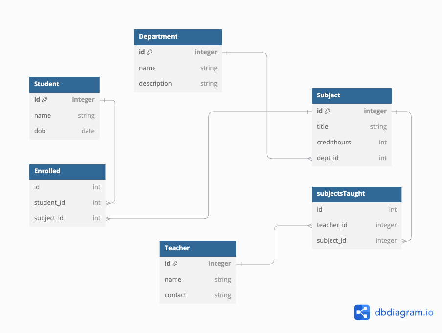

This project will be used to populate the database using FastAPI, SQLAlchemy , Pydantic and Docker.

## Database ERD

### Figure



Use this [link](https://dbdiagram.io/d/672b3730e9daa85aca7ede61) to view online.

## Usage

### Run Locally

Follow the steps to setup this project.

Go to the Project Folder and run the command:

```
source env/bin/activate
```

Now go inside the `app` folder

```
cd app
```

Install the required packages.

```
pip install -r requirements.txt
```

```
fastapi dev main.py
```

### Run on containers

Inside the `app` folder. Run the following command:

```
docker-compose up --build
```

Expected Output:

```
fastapi_app  | INFO:     Started server process [1]
fastapi_app  | INFO:     Waiting for application startup.
fastapi_app  | INFO:     Application startup complete.
fastapi_app  | INFO:     Uvicorn running on http://0.0.0.0:8000 (Press CTRL+C to quit)
```

Now go to the following url to view the docs for the APIs:

```
http://localhost:8000/docs
```
